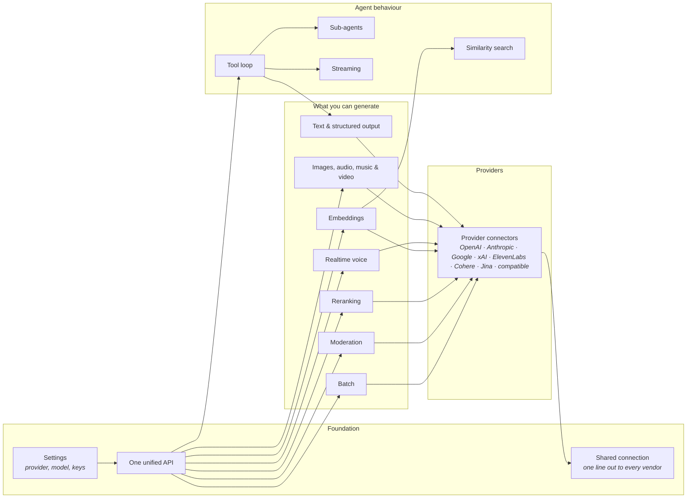

# Overview — Atlas

*Atlas in plain language — written for product, marketing and anyone new, not for developers. What the
parts are and how a request moves through them.*

*This describes the platform as designed. What is proven today is recorded row by row in the contracts —
[`prd/`](./prd/) for the ratified ones, [`prd-drafts/`](./prd-drafts/) for those still in proposal.*

## What this is

Atlas is an open-source toolkit that gives Laravel developers one consistent way to use AI — text, images,
audio, voice, embeddings and more — across every major provider without rewriting code for each one. It is
for PHP and Laravel teams building AI features who want to switch providers, models and capabilities by
changing a single setting instead of stitching vendor toolkits together. It is not sold: it is free,
MIT-licensed open source, and a team adopts it by installing the package.

## The platform

## How it works

- **One unified API** — the single fluent surface a developer writes against for every task.
- **Settings** — choose the provider, model and keys a request uses; swap by changing one string.
- **Tool loop** — runs a request as several steps, calling the app's own tools until the answer is ready.
- **Sub-agents** — lets an agent hand parts of a job to other agents, in parallel, within guardrails.
- **Streaming** — delivers a reply piece by piece as it is produced, rather than waiting for the whole.
- **Text & structured output** — written answers, or clean structured data checked against a shape the app
  defines.
- **Images, audio, music & video** — generates and edits visual and audio media from a prompt.
- **Realtime voice** — a live, two-way spoken conversation with an agent that can still use tools.
- **Embeddings** — turns text into numeric fingerprints so records can be compared by meaning.
- **Similarity search** — finds the records closest in meaning to a query, over whole records or chunks.
- **Reranking** — reorders a set of results by how well each one answers a query.
- **Moderation** — flags unsafe or disallowed content before it reaches a user.
- **Batch** — runs large jobs together at roughly half the cost when speed is not urgent.
- **Provider connectors** — the per-vendor adapters that speak each provider's dialect behind the one API.
- **Shared connection** — the single outbound line every provider call travels, with retries and tracking.

## What you use

- **The Laravel developer** — installs the package and builds against the one API; swaps providers, models
  and modalities by changing a string, never rewriting their app.
- **The app's end users** — chat, speak or get results through features the developer builds on Atlas; they
  never see Atlas itself and touch nothing here directly.
- **The maintainers** — govern the public API and the provider layer, and decide what each release is
  allowed to change for the developers who depend on it.

## What governs it

- **The public API contract** — a documented method, signature or setting never changes without maintainer
  approval, because every installed app depends on it. Set by the maintainers.
  See [`../AGENTS.md`](../AGENTS.md).
- **The layer boundaries** — each part may depend only downward, which is what keeps providers swappable and
  every feature testable. Set by the project's architecture rules. See [`../AGENTS.md`](../AGENTS.md).
- **Versioning & changelog discipline** — every consumer-visible change is recorded, and a breaking change
  is called out with the exact upgrade steps. Set by the release process. See [`../AGENTS.md`](../AGENTS.md).

---
*Editing this file? Follow the standard first: [`guides/docs-overview.md`](./guides/docs-overview.md).*
