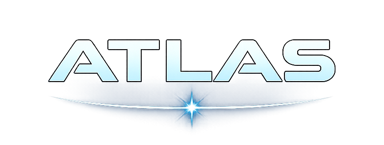

<p align="center">
  <a href="https://atlasphp.org">
    
  </a>
</p>
<p align="center">
    <a href="https://github.com/atlas-php/atlas/actions"></a>
    <a href="https://codecov.io/gh/atlas-php/atlas"></a>
    
    
    
</p>
<p align="center">
    📚 <a href="https://atlasphp.org"><strong>Official Documentation</strong></a>
</p>

# Atlas

Atlas is a Laravel package that brings structure to AI development. It organizes your AI logic into reusable agents, typed tools, and middleware pipelines so you can build production applications without scattering prompts and API calls throughout your codebase.

Built on [Prism PHP](https://prismphp.com), Atlas adds the application layer you need: agent definitions, tool management, prompt templating, and execution pipelines. Prism handles LLM communication; Atlas handles your business logic.

## Features

- **Reusable Agents** - Define AI configurations once, resolve by key or class anywhere
- **Typed Tools** - Connect agents to your services with validated parameters and structured results
- **MCP Tools** - Integrate external tools from MCP servers via [Prism Relay](https://github.com/prism-php/relay)
- **Dynamic Prompts** - Interpolate `{variables}` at runtime for personalized interactions
- **Pipelines** - Add logging, auth, rate limiting, or metrics without touching agent code
- **Full Prism Access** - Use embeddings, images, speech, moderation, and structured output directly

## Quick Start

```bash
composer require atlas-php/atlas

php artisan vendor:publish --tag=atlas-config
```

### Define an Agent

```php
use Atlasphp\Atlas\Agents\AgentDefinition;

class SupportAgent extends AgentDefinition
{
    public function provider(): ?string
    {
        return 'anthropic';
    }

    public function model(): ?string
    {
        return 'claude-sonnet-4-20250514';
    }

    public function systemPrompt(): ?string
    {
        return 'You are a support agent for {company}. Help {user_name} with their questions.';
    }

    public function tools(): array
    {
        return [LookupOrderTool::class, RefundTool::class];
    }
}
```

### Use It

```php
$response = Atlas::agent(SupportAgent::class)
    ->withVariables(['company' => 'Acme', 'user_name' => 'Sarah'])
    ->chat('Where is my order #12345?');

echo $response->text;
```

## Why Atlas?

**The problem:** AI code gets messy fast. Prompts scattered across controllers, duplicated configurations, no consistent way to add logging or rate limiting, and tools tightly coupled to specific features.

**Atlas solves this** by giving you a clear structure:

- **Agents as classes** - Your AI configurations (provider, model, prompts, tools, options) live in dedicated classes. Change once, updates everywhere.
- **Dynamic system prompts** - Interpolate `{variables}` at runtime to inject user context, preferences, or request-specific data into every interaction.
- **Tools with contracts** - Your business logic stays in tool classes with typed parameters. Agents call tools; tools call your services.
- **Pipelines for cross-cutting concerns** - Add logging, authentication, or usage tracking to all AI operations without modifying agent code.
- **Testable by design** - Mock agents, fake tool responses, and verify interactions with standard Laravel testing patterns.

Atlas doesn't replace Prism. It organizes how you use Prism in real applications.

## Documentation

📚 **[atlasphp.org](https://atlasphp.org)** - Full guides, API reference, and examples.

- [Getting Started](https://atlasphp.org/getting-started/installation.html) - Installation and configuration
- [Agents](https://atlasphp.org/core-concepts/agents.html) - Define reusable AI configurations
- [Tools](https://atlasphp.org/core-concepts/tools.html) - Connect agents to your application
- [MCP Integration](https://atlasphp.org/capabilities/mcp.html) - External tools from MCP servers
- [Pipelines](https://atlasphp.org/core-concepts/pipelines.html) - Extend with middleware

## Contributing

We welcome contributions! Please see our [Contributing Guide](.github/CONTRIBUTING.md) for details.

## License

Atlas is open-sourced software licensed under the [MIT license](LICENSE).
