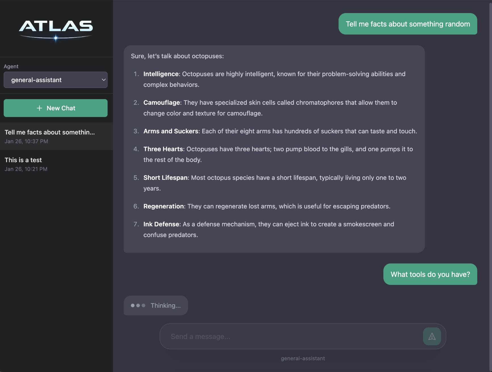

<p align="center">
  <a href="https://atlasphp.org">
    
  </a>
</p>
<p align="center">
    <a href="https://github.com/atlas-php/atlas/actions"></a>
    <a href="https://codecov.io/gh/atlas-php/atlas"></a>
    
    
    
</p>
<p align="center">
    📚 <a href="https://atlasphp.org"><strong>Official Documentation</strong></a> | 🚀 <a href="#-examples"><strong>See Examples (31)</strong></a>
</p>

# 🪐 Atlas

Atlas is a Laravel package for orchestrating AI agents, tools, and execution pipelines.
It provides structure and best practices for building maintainable, testable AI features at the application level.

Built on [Prism PHP](https://prismphp.com), Atlas stays intentionally lightweight by focusing on application-level concerns such as agent definitions, tool orchestration, prompt templates, and execution pipelines. Prism is responsible for all LLM communication and provider APIs.

## ✨ Features

- **Agents** – Define your AI agent behavior and configurations
- **Tools** – Connect agents to your services with validated parameters and structured results
- **MCP Tools** – Integrate external tools from MCP servers via [Prism Relay](https://github.com/prism-php/relay)
- **Dynamic Prompts** – Inject context `{variables}` into system prompts at runtime for personalized interactions
- **Pipelines** – Add logging, auth, rate limiting, or metrics without coupling the codebase
- **Full Prism Access** – Use embeddings, images, speech, moderation, and structured output without limits
- **All Providers**: Anthropic, OpenAI, Gemini, Mistral, Ollama, Groq, DeepSeek, xAI, OpenRouter, ElevenLabs (audio), VoyageAI (embeddings), Local LLMs, and Custom LLMs

## Quick Start

```bash
composer require atlas-php/atlas
```

```bash
# Publish Atlas configuration
php artisan vendor:publish --tag=atlas-config

# Publish Prism configuration (if not already published)
php artisan vendor:publish --tag=prism-config
```

### Define an Agent

```php
use Atlasphp\Atlas\Agents\AgentDefinition;

class SupportAgent extends AgentDefinition
{
    public function provider(): ?string
    {
        return 'anthropic';
    }

    public function model(): ?string
    {
        return 'claude-sonnet-4-20250514';
    }

    public function systemPrompt(): ?string
    {
        return <<<PROMPT
        You are a customer support specialist for {company_name}.

        ## Customer Context
        - **Name:** {customer_name}
        - **Account Tier:** {account_tier}

        ## Available Tools
        - **lookup_order** - Retrieve order details by order ID
        - **process_refund** - Process refunds for eligible orders

        ## Guidelines
        - Always greet the customer by name
        - For order inquiries, use `lookup_order` before providing details
        - Before processing refunds, verify eligibility using order data
        PROMPT;
    }

    public function tools(): array
    {
        return [
            LookupOrderTool::class, 
            RefundTool::class
        ];
    }
}
```

### Build a Tool

```php
use Atlasphp\Atlas\Tools\ToolDefinition;
use Atlasphp\Atlas\Tools\Support\ToolContext;
use Atlasphp\Atlas\Tools\Support\ToolParameter;
use Atlasphp\Atlas\Tools\Support\ToolResult;

class LookupOrderTool extends ToolDefinition
{
    public function __construct(
        private OrderService $orders
    ) {}

    public function name(): string
    {
        return 'lookup_order';
    }

    public function description(): string
    {
        return 'Look up order details by order ID';
    }

    public function parameters(): array
    {
        return [
            ToolParameter::string('order_id', 'The order ID to look up', required: true),
        ];
    }

    public function handle(array $params, ToolContext $context): ToolResult
    {
        $order = $this->orders->find($params['order_id']);

        if (! $order) {
            return ToolResult::error('Order not found');
        }

        return ToolResult::json($order->toArray());
    }
}
```

### Chat with the Agent

```php
$response = Atlas::agent(SupportAgent::class)
    ->withVariables([
        'company_name' => 'Acme', 
        'customer_name' => 'Sarah',
        'account_tier' => 'Premium',
    ])
    ->chat('Where is my order #12345?');

echo $response->text();
// $response->usage();
// Hello Sarah, your order is out for delivery. Anything else I can help with?
```

## Why Atlas?

**The problem:** Prompts scattered across controllers, duplicated configurations, businesses logic tightly coupled with tools, and no consistent way to add logging, validation or even proper error handling.

**Atlas decouples your businesses logic:**

- **Agents** - AI configurations live in dedicated classes, not inline across your codebase.
- **Tools** - Business logic stays in tool classes with typed parameters. Agents call tools; tools call your services.
- **Pipelines** - Add logging, auth, or metrics to all Prism/Atlas operations without coupling the codebase.
- **Testable** - Mock agents and fake tool responses with standard Laravel testing patterns.

Atlas doesn't replace Prism. It organizes how you use Prism in real applications.

## Documentation

📚 **[atlasphp.org](https://atlasphp.org)** - Full guides, API reference, and examples.

- [Getting Started](https://atlasphp.org/getting-started/installation.html) - Installation and configuration
- [Agents](https://atlasphp.org/core-concepts/agents.html) - Define reusable AI configurations
- [Tools](https://atlasphp.org/core-concepts/tools.html) - Connect agents to your application
- [MCP Integration](https://atlasphp.org/capabilities/mcp.html) - External tools from MCP servers
- [Pipelines](https://atlasphp.org/core-concepts/pipelines.html) - Extend with middleware

## 🚀 Examples

**Agents** — Reusable AI configurations for different roles and tasks.
- [Customer Support](https://atlasphp.org/core-concepts/agents.html#example-basic-agent)
- [Sales Support](https://atlasphp.org/core-concepts/agents.html#example-sales-support-agent)
- [Customer Service](https://atlasphp.org/core-concepts/agents.html#example-customer-service-agent)
- [Code Review](https://atlasphp.org/core-concepts/agents.html#example-code-review-agent)
- [Content Writer](https://atlasphp.org/core-concepts/agents.html#example-content-writer-agent)
- [Data Analyst](https://atlasphp.org/core-concepts/agents.html#example-data-analyst-agent)
- [HR Assistant](https://atlasphp.org/core-concepts/agents.html#example-hr-assistant-agent)
- [IT Helpdesk (MCP)](https://atlasphp.org/core-concepts/agents.html#example-it-helpdesk-agent-with-mcp-tools)
- [Orchestrator](https://atlasphp.org/core-concepts/tools.html#example-agent-delegation-tools)

**Tools** — Connect agents to your application logic and external services.
- [Order Lookup](https://atlasphp.org/core-concepts/tools.html#example-order-lookup-tool)
- [Knowledge Base Search](https://atlasphp.org/core-concepts/tools.html#example-search-knowledge-base-tool)
- [Create Ticket](https://atlasphp.org/core-concepts/tools.html#example-create-support-ticket-tool)
- [Send Notification](https://atlasphp.org/core-concepts/tools.html#example-send-notification-tool)
- [Database Query](https://atlasphp.org/core-concepts/tools.html#example-tool-with-dependencies)
- [Agent Delegation](https://atlasphp.org/core-concepts/tools.html#example-agent-delegation-tools)

**Pipelines** — Middleware for logging, auth, caching, and error handling.
- [Audit Logging](https://atlasphp.org/core-concepts/pipelines.html#example-audit-logging)
- [Authentication](https://atlasphp.org/core-concepts/pipelines.html#example-authentication-check)
- [Rate Limiting](https://atlasphp.org/core-concepts/pipelines.html#example-tool-rate-limiting)
- [Token Usage](https://atlasphp.org/core-concepts/pipelines.html#example-token-usage-logging)
- [Cache Embeddings](https://atlasphp.org/core-concepts/pipelines.html#example-caching-embeddings)
- [Error Recovery](https://atlasphp.org/core-concepts/pipelines.html#agent-on-error)

**Capabilities** — Streaming, structured output, vision, audio, and more.
- [Streaming](https://atlasphp.org/capabilities/streaming.html#example-complete-streaming-service)
- [Structured Output](https://atlasphp.org/capabilities/structured-output.html#examples)
- [Multi-Turn Chat](https://atlasphp.org/capabilities/chat.html#multi-turn-conversations)
- [Semantic Search](https://atlasphp.org/capabilities/embeddings.html#example-semantic-search)
- [RAG](https://atlasphp.org/capabilities/embeddings.html#example-rag-implementation)
- [Vision](https://atlasphp.org/capabilities/chat.html#attachments)
- [Text-to-Speech](https://atlasphp.org/capabilities/audio.html#text-to-speech-examples)
- [Speech-to-Text](https://atlasphp.org/capabilities/audio.html#speech-to-text-examples)
- [Content Moderation](https://atlasphp.org/capabilities/moderation.html#example-comment-moderation)
- [Image Generation](https://atlasphp.org/capabilities/images.html#example-complete-image-generation)

## 💬 Sandbox - Atlas Chat Example

A fully functional chat interface demonstrating Atlas agents in action. Built with Vue 3, Tailwind CSS, and a Laravel JSON API.

<p align="left">
  
</p>

👉 **[See the Sandbox README](./sandbox/README.md)** for setup instructions and details.

## Testing and Code Quality

Atlas uses several tools to maintain high code quality:

```bash
composer check
```

| Tool                                             | Purpose                                                                                                                |
|--------------------------------------------------|------------------------------------------------------------------------------------------------------------------------|
| [Pest](https://pestphp.com)                      | Testing framework                                                                                                      |
| [Larastan](https://github.com/larastan/larastan) | Static analysis                                                                                                        |
| [Laravel Pint](https://laravel.com/docs/pint)    | Code style                                                                                                             |
| [Codecov](https://codecov.io/gh/atlas-php/atlas) | [](https://codecov.io/gh/atlas-php/atlas) |

## Contributing

We welcome contributions!

Support the community by giving a GitHub star ⭐️. Thank you!

Please see our [Contributing Guide](.github/CONTRIBUTING.md) for details.

## License

Atlas is open-sourced software licensed under the [MIT license](LICENSE).
