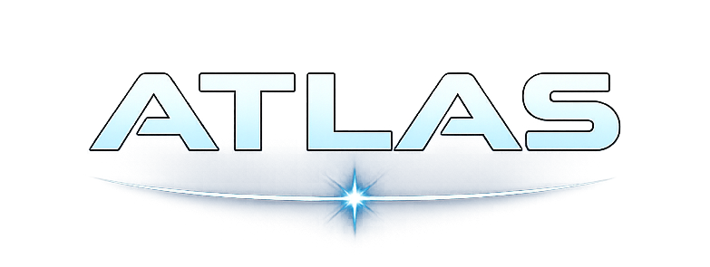
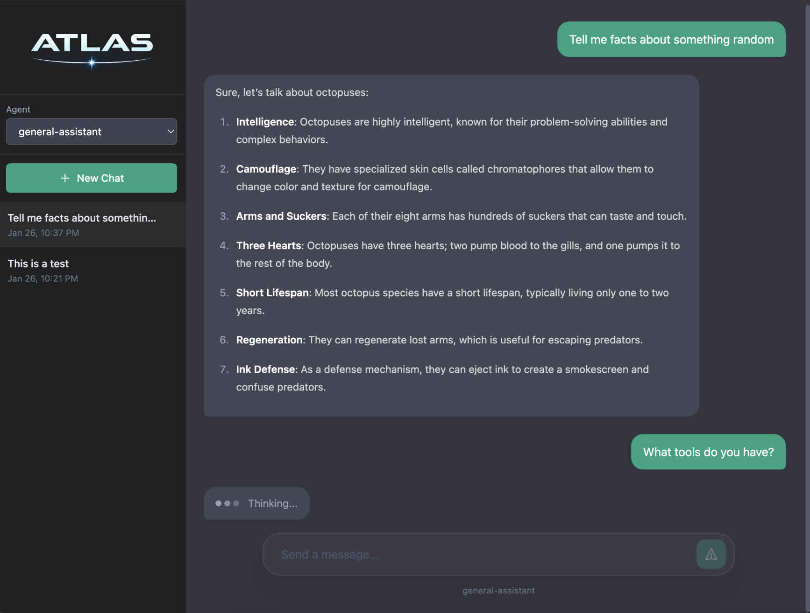

<p align="center">
  <a href="https://atlasphp.org">
    
  </a>
</p>
<p align="center">
    <a href="https://github.com/atlas-php/atlas/actions"></a>
    <a href="https://codecov.io/gh/atlas-php/atlas"></a>
    <a href="https://packagist.org/packages/atlas-php/atlas"></a>
    
    
    
</p>
<p align="center">
    📚 <a href="https://atlasphp.org"><strong>Documentation</strong></a>
</p>

# 🪐 Atlas

Atlas is a unified AI execution layer for Laravel. It owns its own provider layer — no external AI package dependency. Atlas talks directly to AI provider APIs, manages the tool call loop, and provides optional persistence for conversations, execution tracking, and agent memory.

## ✨ Features

- **Agents** — Reusable classes encapsulating provider, model, instructions, tools, and behavior
- **Tools** — Typed tool classes with parameter schemas and dependency injection
- **10 Modalities** — Text, images, audio (speech, music, sound effects), video, voice, embeddings, reranking
- **Variable Interpolation** — `{variable}` placeholders in instructions resolved at runtime
- **Middleware** — Four layers (agent, step, tool, provider) for logging, auth, metrics, and control
- **Structured Output** — Schema-validated JSON responses from any provider
- **Streaming** — SSE and Laravel Broadcasting with real-time chunk delivery
- **Voice** — Real-time bidirectional voice conversations with tool support
- **Conversations** — Multi-turn chat with message history, retry, and sibling tracking
- **Persistence** — Optional execution tracking and asset storage
- **Queue Support** — Async execution with broadcasting and callbacks
- **Testing** — Full fake system with assertions — no API keys required
- **Provider Tools** — Web search, code interpreter, file search via provider-native tools
- **Provider Discovery** — List available models, voices, and run content moderation
- **Custom Providers** — OpenAI-compatible endpoints or fully custom drivers
- **All Providers** — OpenAI, Anthropic, Google (Gemini), xAI (Grok), ElevenLabs, Cohere, Jina, plus any OpenAI-compatible API (Ollama, Groq, DeepSeek, Together, OpenRouter, LM Studio)

## 🚀 Quick Start

```bash
composer require atlas-php/atlas
```

Supports Laravel 11+.

```bash
php artisan vendor:publish --tag=atlas-config
```

### Define an Agent

```php
use Atlasphp\Atlas\Agent;

class SupportAgent extends Agent
{
    public function provider(): ?string
    {
        return 'anthropic';
    }

    public function model(): ?string
    {
        return 'claude-sonnet-4-20250514';
    }

    public function instructions(): ?string
    {
        return <<<'PROMPT'
        You are a customer support specialist for {company_name}.

        ## Customer Context
        - **Name:** {customer_name}
        - **Account Tier:** {account_tier}

        ## Guidelines
        - Always greet the customer by name
        - For order inquiries, use `lookup_order` before providing details
        - Before processing refunds, verify eligibility using order data
        PROMPT;
    }

    public function tools(): array
    {
        return [
            LookupOrderTool::class,
            ProcessRefundTool::class,
        ];
    }
}
```

### Build a Tool

```php
use Atlasphp\Atlas\Tools\Tool;
use Atlasphp\Atlas\Schema\Fields\StringField;

class LookupOrderTool extends Tool
{
    public function __construct(
        private OrderService $orders
    ) {}

    public function name(): string
    {
        return 'lookup_order';
    }

    public function description(): string
    {
        return 'Look up order details by order ID';
    }

    public function parameters(): array
    {
        return [
            new StringField('order_id', 'The order ID to look up'),
        ];
    }

    public function handle(array $args, array $context): mixed
    {
        $order = $this->orders->find($args['order_id']);

        return $order ? $order->toArray() : 'Order not found';
    }
}
```

### Chat with the Agent

```php
$response = Atlas::agent('support')
    ->withVariables([
        'company_name' => 'Acme',
        'customer_name' => 'Sarah',
        'account_tier' => 'Premium',
    ])
    ->message('Where is my order #12345?')
    ->asText();

$response->text;    // "Hello Sarah! Let me look that up..."
$response->usage;   // Token usage
$response->steps;   // Tool call loop history
```

### Speak with the Agent (Voice to Voice)

```php
$session = Atlas::agent('support')
    ->withVariables([
        'company_name' => 'Acme',
        'customer_name' => 'Sarah',
        'account_tier' => 'Premium',
    ])
    ->asVoice();

return response()->json($session->toClientPayload());
// Returns ephemeral token + connection URL for WebRTC/WebSocket
```

See the [Voice Integration Guide](https://atlasphp.org/guides/voice-integration.html) for full setup instructions.

## 💡 Why Atlas?

**The problem:** Prompts scattered across controllers, duplicated configurations, business logic tightly coupled with AI calls, and no consistent way to add logging, validation, or error handling.

**Atlas structures your AI layer:**

- **Agents** — AI configurations live in dedicated classes, not inline across your codebase.
- **Tools** — Business logic stays in tool classes with typed parameters. Agents call tools; tools call your services.
- **Middleware** — Add logging, auth, or metrics at four execution layers without coupling the codebase.
- **Testable** — Full fake system with per-modality assertions using standard Laravel testing patterns.

## 📖 Documentation

**[atlasphp.org](https://atlasphp.org)** — Full guides, API reference, and examples.

- [Getting Started](https://atlasphp.org/getting-started/installation.html) — Installation and configuration
- [Agents](https://atlasphp.org/features/agents.html) — Define reusable AI configurations
- [Tools](https://atlasphp.org/features/tools.html) — Connect agents to your application
- [Middleware](https://atlasphp.org/features/middleware.html) — Extend with four middleware layers
- [Modalities](https://atlasphp.org/modalities/text.html) — Text, images, audio, video, voice, embeddings, and more
- [Conversations](https://atlasphp.org/guides/conversations.html) — Multi-turn chat with persistence
- [Voice](https://atlasphp.org/guides/voice-integration.html) — Real-time voice conversations
- [Streaming](https://atlasphp.org/guides/streaming.html) — SSE and broadcasting
- [Queue](https://atlasphp.org/guides/queue.html) — Background execution
- [Testing](https://atlasphp.org/advanced/testing.html) — Fakes and assertions

## 🧪 Sandbox

A fully functional chat interface demonstrating Atlas agents in action. Built with Vue 3, Tailwind CSS, and a Laravel JSON API.

<p align="left">
  
</p>

See the [Sandbox README](./sandbox/README.md) for setup instructions and details.

## 🧹 Testing and Code Quality

Atlas uses several tools to maintain high code quality:

```bash
composer check
```

| Tool                                             | Purpose                                                                                                                |
|--------------------------------------------------|------------------------------------------------------------------------------------------------------------------------|
| [Pest](https://pestphp.com)                      | Testing framework                                                                                                      |
| [Larastan](https://github.com/larastan/larastan) | Static analysis                                                                                                        |
| [Laravel Pint](https://laravel.com/docs/pint)    | Code style                                                                                                             |
| [Codecov](https://codecov.io/gh/atlas-php/atlas) | [](https://codecov.io/gh/atlas-php/atlas) |

## 🤝 Contributing

We welcome contributions!

Support the community by giving a GitHub star. Thank you!

Please see our [Contributing Guide](.github/CONTRIBUTING.md) for details.

## 📄 License

Atlas is open-sourced software licensed under the [MIT license](LICENSE).
