<p align="center">
  <a href="https://atlasphp.org">
    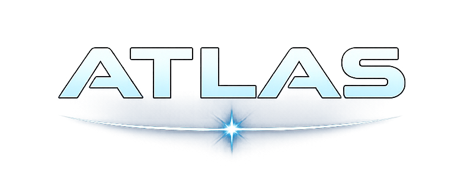
  </a>
</p>
<p align="center">
    <a href="https://github.com/atlas-php/atlas/actions"></a>
    <a href="https://codecov.io/gh/atlas-php/atlas/branch/3.x"></a>
    <a href="https://packagist.org/packages/atlas-php/atlas"></a>
    
    
    
</p>
<p align="center">
    📚 <a href="https://atlasphp.org"><strong>Documentation</strong></a>
    &nbsp;·&nbsp;
    🧪 <a href="#-sandbox"><strong>Sandbox &amp; Examples</strong></a>
</p>

# 🪐 Atlas

Atlas is a unified AI SDK for Laravel applications. It owns its own provider layer — no external AI package dependency. Atlas talks directly to AI provider APIs, manages the tool call loop, and provides optional persistence for conversations, execution tracking, and agent memory.

## ✨ Features

- **Agents**
  - Reusable classes encapsulating provider, model, instructions, tools, and behavior
- **Tools**
  - Typed tool classes with parameter schemas and dependency injection
- **Sub-agents**
  - Delegate tasks to other agents as tools, with isolated context, depth/cycle guards, and an auditable parent → child execution tree. Fan out to multiple sub-agents **concurrently** (true parallel execution via forking) so independent work runs at the same time
- **10 Modalities**
  - Text, images, audio (speech, music, sound effects), video, voice, embeddings, reranking
- **Similarity Search**
  - Unified `Atlas::similaritySearch()` over whole-record or chunked embeddings; also available as an agent tool
- **Chunked Embeddings**
  - Index long-form, frequently-edited content with diff-based reconciliation — edits re-embed only what changed
- **Variable Interpolation**
  - `{variable}` placeholders in instructions resolved at runtime
- **Middleware**
  - Four layers (agent, step, tool, provider) for logging, auth, metrics, and control
- **Structured Output**
  - Schema-validated JSON responses from any provider
- **Streaming**
  - SSE and Laravel Broadcasting with real-time chunk delivery
- **Voice**
  - Real-time bidirectional voice conversations with tool support
- **Conversations**
  - Multi-turn chat with message history, retry, and sibling tracking
- **Persistence**
  - Optional execution tracking and asset storage
- **Queue Support**
  - Async execution with broadcasting and callbacks
- **Testing**
  - Full fake system with assertions — no API keys required
- **Provider Tools**
  - Web search, code interpreter, file search via provider-native tools
- **Provider Discovery**
  - List available models, voices, and run content moderation
- **Custom Providers**
  - OpenAI-compatible endpoints or fully custom drivers
- **All Providers**
  - OpenAI, Anthropic, Google (Gemini), xAI (Grok), ElevenLabs, Cohere, Jina, plus any OpenAI-compatible API (Ollama, Groq, DeepSeek, Together, OpenRouter, LM Studio)

## 🚀 Quick Start

```bash
composer require atlas-php/atlas
```

Supports Laravel 11+.

```bash
php artisan vendor:publish --tag=atlas-config
```

### Define an Agent

```php
use Atlasphp\Atlas\Agent;

class SupportAgent extends Agent
{
    public function provider(): ?string
    {
        return 'anthropic';
    }

    public function model(): ?string
    {
        return 'claude-sonnet-4-20250514';
    }

    public function instructions(): ?string
    {
        return <<<'PROMPT'
        You are a customer support specialist for {company_name}.

        ## Customer Context
        - **Name:** {customer_name}
        - **Account Tier:** {account_tier}

        ## Guidelines
        - Always greet the customer by name
        - For order inquiries, use `lookup_order` before providing details
        - Before processing refunds, verify eligibility using order data
        PROMPT;
    }

    public function tools(): array
    {
        return [
            LookupOrderTool::class,
            ProcessRefundTool::class,
        ];
    }
}
```

### Build a Tool

```php
use Atlasphp\Atlas\Tools\Tool;
use Atlasphp\Atlas\Schema\Fields\StringField;

class LookupOrderTool extends Tool
{
    public function __construct(
        private OrderService $orders
    ) {}

    public function name(): string
    {
        return 'lookup_order';
    }

    public function description(): string
    {
        return 'Look up order details by order ID';
    }

    public function parameters(): array
    {
        return [
            new StringField('order_id', 'The order ID to look up'),
        ];
    }

    public function handle(array $args, array $context): mixed
    {
        $order = $this->orders->find($args['order_id']);

        return $order ? $order->toArray() : 'Order not found';
    }
}
```

### Chat with the Agent

```php
$response = Atlas::agent('support')
    ->withVariables([
        'company_name' => 'Acme',
        'customer_name' => 'Sarah',
        'account_tier' => 'Premium',
    ])
    ->withTools([
        HelpDeskSearchTool::class,
        OrderStatusTool::class,
    ])
    ->message('Where is my order #12345?')
    ->asText();

$response->text;    // "Hello Sarah! Let me look that up..."
$response->usage;   // Token usage
$response->steps;   // Tool call loop history
```

### Speak with the Agent (Voice to Voice)

```php
$session = Atlas::agent('support')
    ->withVariables([
        'company_name' => 'Acme',
        'customer_name' => 'Sarah',
        'account_tier' => 'Premium',
    ])
    ->asVoice();

return response()->json($session->toClientPayload());
// Returns ephemeral token + connection URL for WebRTC/WebSocket
```

See the [Voice Integration Guide](https://atlasphp.org/guides/voice-integration/) for full setup instructions.

## 💡 Why Atlas?

**The problem:** Prompts scattered across controllers, duplicated configurations, business logic tightly coupled with AI calls, and no consistent way to add logging, validation, or error handling.

**Atlas structures your AI layer:**

- **Agents** — AI configurations live in dedicated classes, not inline across your codebase.
- **Tools** — Business logic stays in tool classes with typed parameters. Agents call tools; tools call your services.
- **Middleware** — Add logging, auth, or metrics at four execution layers without coupling the codebase.
- **Testable** — Full fake system with per-modality assertions using standard Laravel testing patterns.

## 📖 Documentation

**[atlasphp.org](https://atlasphp.org)** — Full guides, API reference, and examples.

- [Getting Started](https://atlasphp.org/getting-started/installation/) — Installation and configuration
- [Agents](https://atlasphp.org/features/agents/) — Define reusable AI configurations
- [Tools](https://atlasphp.org/features/tools/) — Connect agents to your application
- [Sub-agents](https://atlasphp.org/features/sub-agents/) — Agent-to-agent delegation, including concurrent (parallel) fan-out
- [Middleware](https://atlasphp.org/features/middleware/) — Extend with four middleware layers
- [Similarity Search](https://atlasphp.org/features/similarity-search/) — Semantic search over whole-record or chunked embeddings
- [Modalities](https://atlasphp.org/modalities/text/) — Text, images, audio, video, voice, embeddings, and more
- [Conversations](https://atlasphp.org/guides/conversations/) — Multi-turn chat with persistence
- [Voice](https://atlasphp.org/guides/voice-integration/) — Real-time voice conversations
- [Streaming](https://atlasphp.org/guides/streaming/) — SSE and broadcasting
- [Queue](https://atlasphp.org/guides/queue/) — Background execution
- [Testing](https://atlasphp.org/advanced/testing/) — Fakes and assertions

## 🧪 Sandbox

A fully functional chat interface demonstrating Atlas agents in action — multi-agent chat, tool calling, conversation memory, and live image/video generation. Built with Vue 3, Tailwind CSS, and a Laravel JSON API.

<table>
  <tr>
    <td width="50%" align="center">
      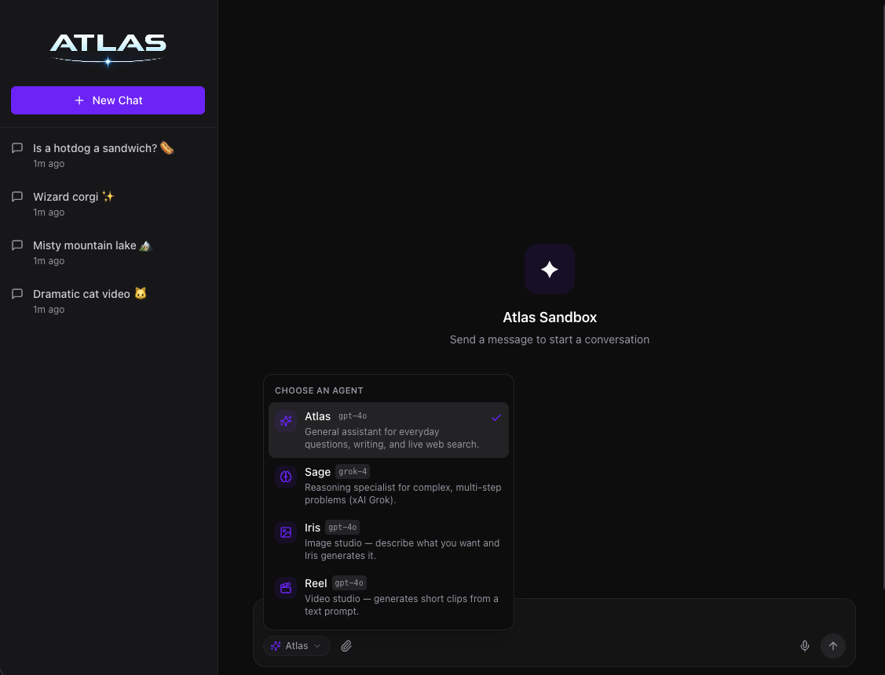<br>
      <sub><b>Pick from multiple agents</b> — each with its own model and tools</sub>
    </td>
    <td width="50%" align="center">
      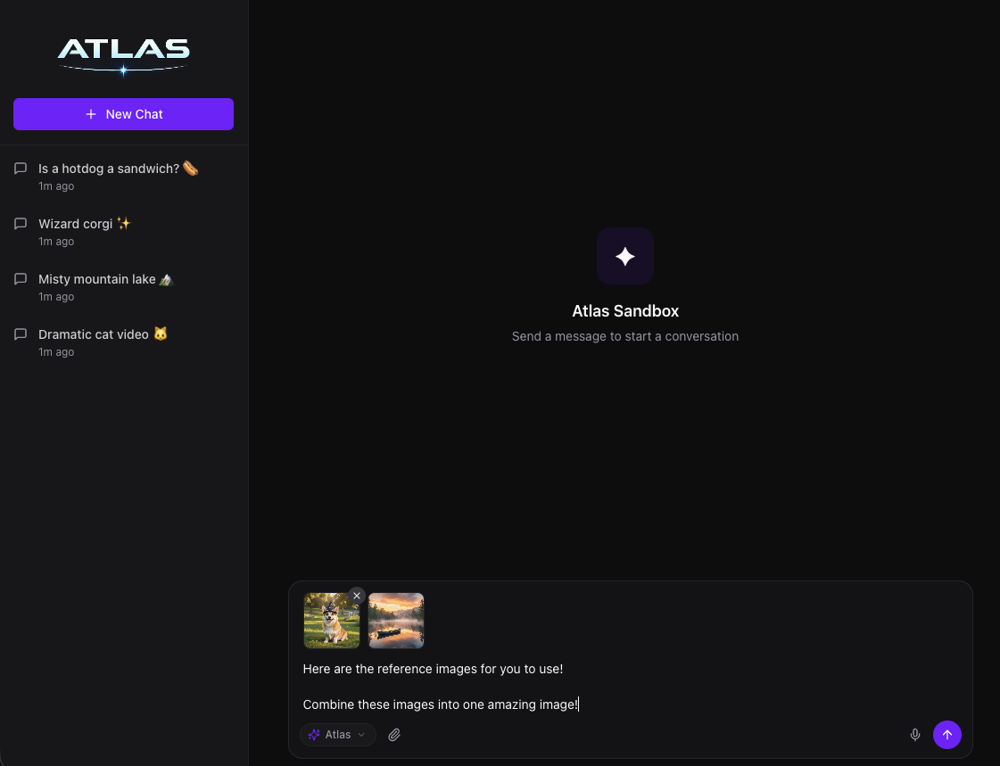<br>
      <sub><b>Multi-modal input</b> — attach multiple images in one message</sub>
    </td>
  </tr>
  <tr>
    <td width="50%" align="center">
      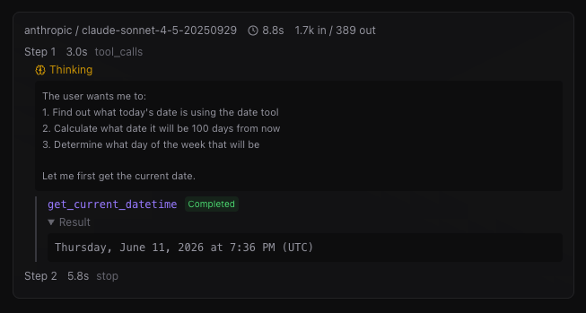<br>
      <sub><b>Extended thinking</b> — stream the model's reasoning and inspect it per step</sub>
    </td>
    <td width="50%" align="center">
      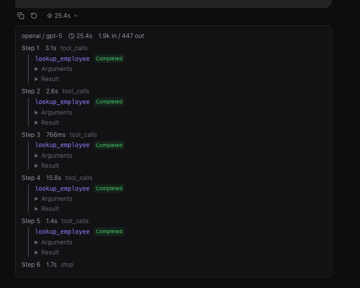<br>
      <sub><b>Tool calling</b> — full execution trace with arguments and results</sub>
    </td>
  </tr>
  <tr>
    <td width="50%" align="center">
      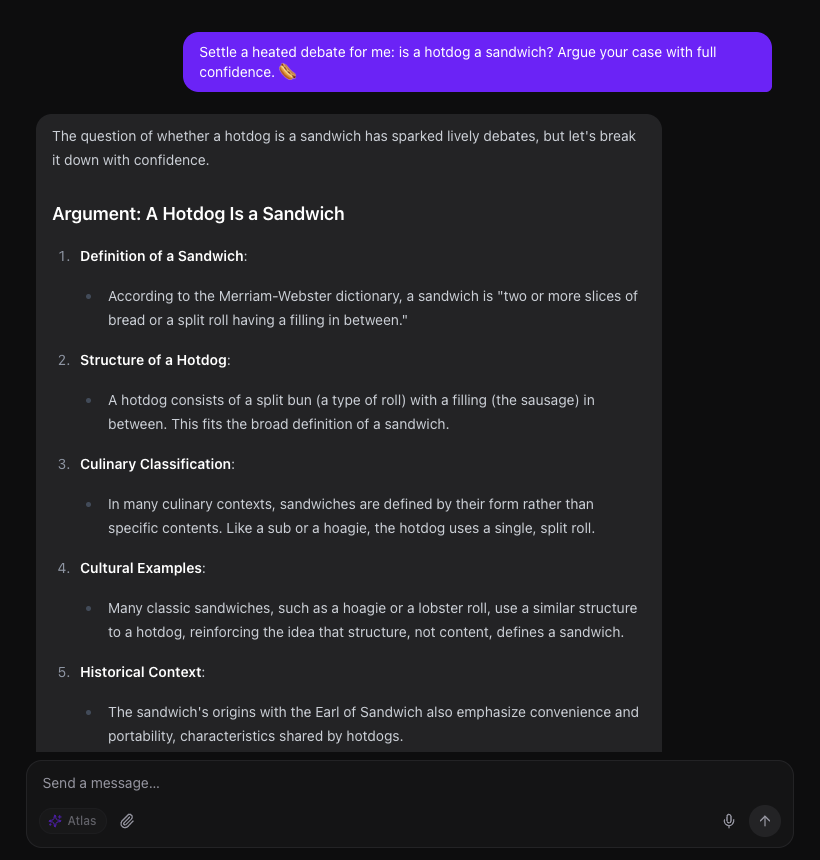<br>
      <sub><b>Streaming Markdown chat</b> with full execution traces</sub>
    </td>
    <td width="50%" align="center">
      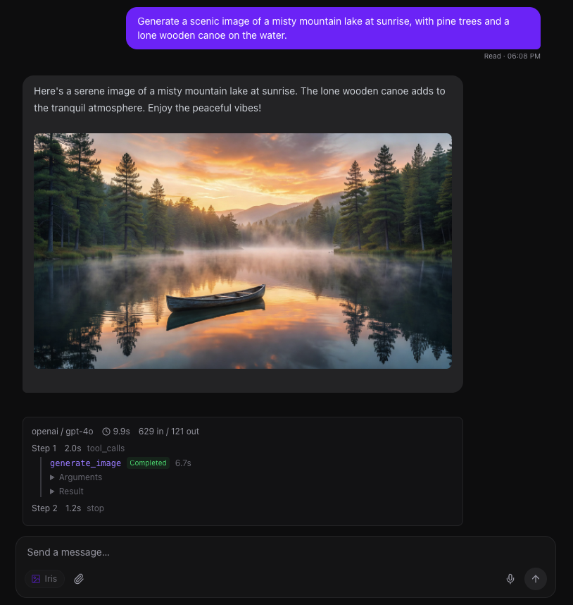<br>
      <sub><b>Image generation</b> rendered inline from a tool call</sub>
    </td>
  </tr>
  <tr>
    <td width="50%" align="center">
      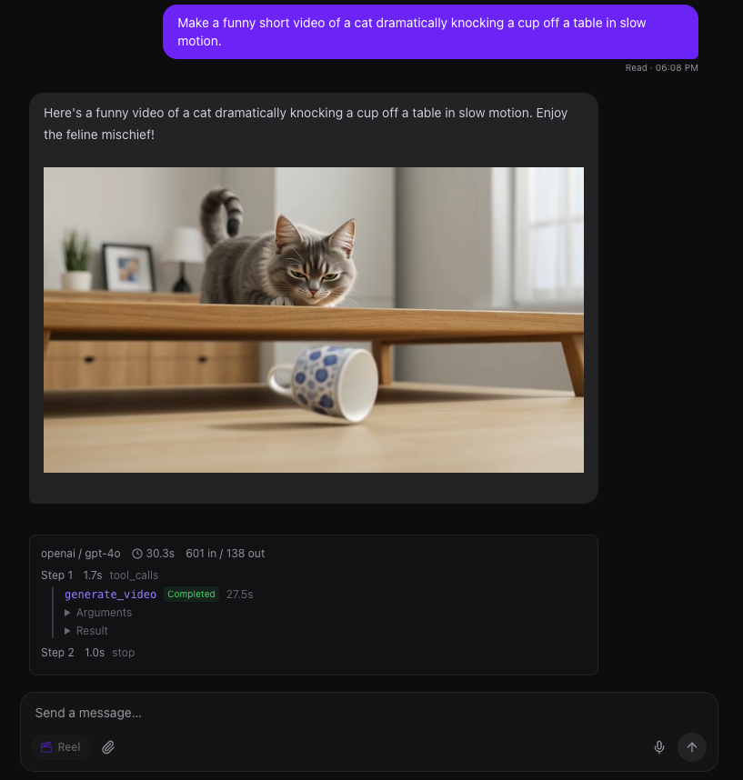<br>
      <sub><b>Video generation</b> that plays right in the thread</sub>
    </td>
    <td width="50%" align="center">
      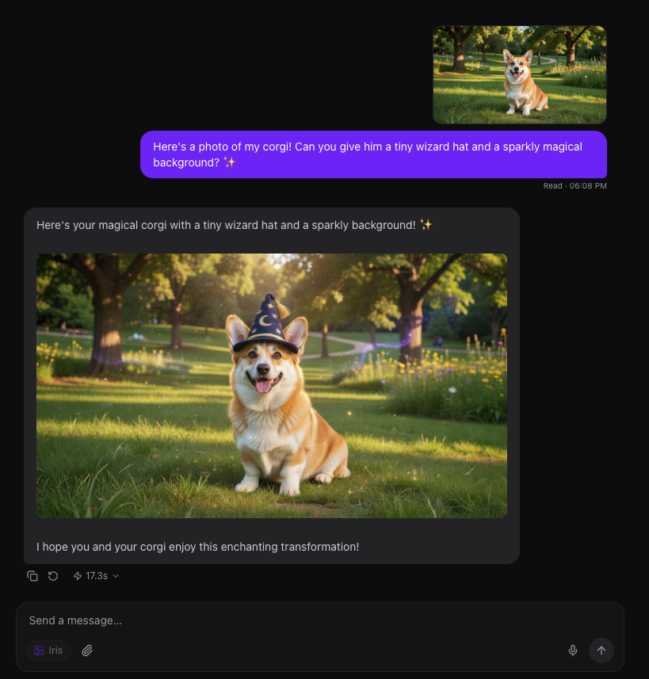<br>
      <sub><b>Image editing</b> — upload a photo and have an agent restyle it</sub>
    </td>
  </tr>
  <tr>
    <td width="50%" align="center">
      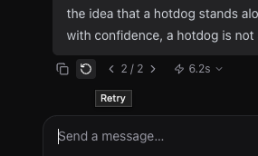<br>
      <sub><b>Retry &amp; branch</b> — regenerate any reply and step through versions</sub>
    </td>
    <td width="50%" align="center">
      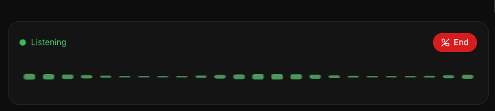<br>
      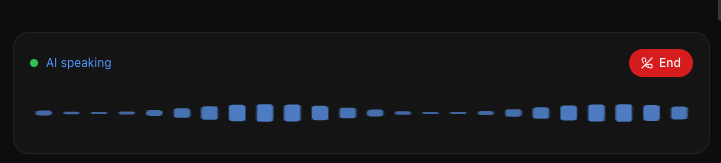<br>
      <sub><b>Realtime voice</b> — live waveform as you speak and as the AI replies</sub>
    </td>
  </tr>
</table>

See the [Sandbox README](./sandbox/README.md) for setup instructions and details.

## 🧹 Testing and Code Quality

Atlas uses several tools to maintain high code quality:

```bash
composer check
```

| Tool                                             | Purpose                                                                                                                |
|--------------------------------------------------|------------------------------------------------------------------------------------------------------------------------|
| [Pest](https://pestphp.com)                      | Testing framework                                                                                                      |
| [Larastan](https://github.com/larastan/larastan) | Static analysis                                                                                                        |
| [Laravel Pint](https://laravel.com/docs/pint)    | Code style                                                                                                             |
| [API Audit](./AUDIT.md)                     | Every provider modality verified against **real provider APIs** |
| [Codecov](https://codecov.io/gh/atlas-php/atlas/branch/3.x) | [](https://codecov.io/gh/atlas-php/atlas/branch/3.x) |

## 🤝 Contributing

We welcome contributions!

Support the community by giving a GitHub star. Thank you!

Please see our [Contributing Guide](.github/CONTRIBUTING.md) for details.

## 📄 License

Atlas is open-sourced software licensed under the [MIT license](LICENSE).
